<style>
pre code {
  background-color: #f2f2f2 !important;
  display: block;
  padding: 0.8em;
  border-radius: 6px;
}
code {
  background-color: #f2f2f2 !important;
  padding: 0.15em 0.35em;
  border-radius: 4px;
}
</style>

This report summarises the bioinformatics workflow applied to the Chukchi Sea eRNA samples to study the Nitrogen cycles, particularly the denitrifcation and anammox metabolic pathways, using metatranscriptomics approach.

## 🧪 Sample Processing, Sequencing & Data Availability

The Centre for Genomic Research (CGR) processed **9 marine eRNA samples** (+ 1 negative control) for metatranscriptomic sequencing as part of project **SSP203072**. The workflow included:

- DNase treatment of all extracted RNA samples.

- rRNA depletion using the *Seawater riboPOOL* kit.

- Construction of **Illumina RNA-seq libraries** from the rRNA-depleted material.

Multiplexing of all libraries and sequencing on one lane of an **Illumina NovaSeq X Plus** (NovaSeq X+) 25B flow cell.

This setup is expected to produce approximately **~325 million read pairs per sample**, providing deep metatranscriptomic coverage suitable for resolving nitrogen-cycling pathways, including denitrification and anammox.

**Funding & administrative details:**

- **SSP ID**: SSP203072

- **Platform**: Illumina NovaSeq X+

- **Funding**: NEOF1819 — Purchase Order P11212-200

All files—including raw data, processing details, and download instructions—are available via:

[Project data download](https://cgr.liv.ac.uk/illum/SSP203072_b7beb589a74e3e61/)

## 📊 Sequencing Output & CGR QC Summary

| Name                                                                 | Raw Reads (M) | Trimmed Reads (M) | Raw Bases (M) | Trimmed Bases (M) |
|----------------------------------------------------------------------|---------------|--------------------|----------------|--------------------|
| 1-S4S                                                                | 422.03        | 418.30             | 126,608.75     | 120,507.35         |
| 2-S4M                                                                | 559.84        | 557.67             | 167,952.06     | 163,451.31         |
| 3-S4B                                                                | 613.03        | 611.42             | 183,908.71     | 179,372.50         |
| <span style="color:red;">4-S13S</span>                               | 9.89          | 7.81               | 2,968.42       | 2,244.11           |
| 5-S13M                                                               | 240.41        | 238.67             | 72,124.26      | 70,520.45          |
| 6-S13B                                                               | 617.78        | 615.94             | 185,334.01     | 181,063.09         |
| 7-S14S                                                               | 526.76        | 524.35             | 158,026.71     | 153,976.49         |
| 8-S14M                                                               | 526.33        | 524.19             | 157,899.00     | 153,074.61         |
| 9-S14B                                                               | 571.17        | 569.59             | 171,349.89     | 166,325.31         |
| <span style="color:red;">10-negative_control</span>                  | 5.92          | 5.16               | 1,776.58       | 1,487.48           |

**Description of Methods**
The raw FASTQ files are trimmed for the presence of Illumina adapter sequences using Cutadapt version 4.5 . The option -O 3 was used, meaning that trimming occurred in reads where at least 3bp of adapter sequence was observed at the 3' end of the read. The reads were further trimmed to remove low quality bases with a minimum window quality score of 20. After trimming, reads shorter than 15 bp were removed. Only read pairs are retained, therefore if a read of a pair is trimmed away then the other read in the pair is also discarded.

::: {.callout-note title="📝 Notes on Low-Yield Samples"}
**4-S13S** returned an exceptionally low number of reads because very little RNA was recovered from the corresponding Sterivex filters. This limited input material resulted in poor library complexity and low overall sequencing yield.

**10-negative_control** is a processing negative control sample and therefore contains no biological RNA. The very low read count is expected and confirms that minimal contamination occurred during library preparation.
:::

# 🧪 Bioinformatics Workflow

## rRNA Removal – **SortMeRNA**

To enrich for mRNA and other non-rRNA transcripts, we removed ribosomal RNA using **SortMeRNA**.

The command below shows the SortMeRNA run that was used for each sample. We used the CGR-trimmed paired-end reads as input and the **smr_v4.3_sensitive_db_rfam_seeds** database for rRNA identification.

```{bash}
#| eval: false   
#| echo: true
sortmerna \
  --ref "smr_v4.3_sensitive_db_rfam_seeds.fasta" \
  --reads "$R1" \
  --reads "$R2" \
  --threads "$SLURM_CPUS_PER_TASK" \
  --fastx \
  --out2 \
  --paired_in \
  --aligned "${SAMPLE}_rRNA" \
  --other "${SAMPLE}_RNA_clean" \
  --workdir "$WORKDIR"
``` 

For each sample, SortMeRNA produces:

*_rRNA_* files containing reads classified as rRNA

*_RNA_clean_* files containing the rRNA-depleted read pairs, which are carried forward to assembly.

## De Novo Assembly – **MEGAHIT**

We performed a co-assembly of selected rRNA-depleted samples using MEGAHIT, optimised for complex metatranscriptomic data with the meta-sensitive preset. For illustration, the command below shows the co-assembly of samples:

```{bash}   
#| eval: false   
#| echo: true
megahit 
-1 [station_samples]_RNA_clean_fwd.fq.gz 
-2 [station_samples]_RNA_clean_rev.fq.gz 
-t 60 
--presets meta-sensitive 
--min-contig-len 500 
-m 0.9 
-o St[1:3]_megahit_out
```

Assembly statistics for an example MEGAHIT run (St1) were obtained using seqkit:

```{bash}
#| eval: false   
#| echo: true
seqkit stats final.contigs.fa
```

For example (St1 assembly):

| Assembly           | # Contigs | Total Length (bp) | Min Length (bp) | Mean Length (bp) | Max Length (bp) |
| ------------------ | --------- | ----------------- | --------------- | ---------------- | --------------- |
| `final.contigs.fa` | 1,432,902 | 1,457,453,119     | 500             | 1,017.1          | 106,426         |

These statistics indicate a highly fragmented but deep assembly, typical of complex marine microbial metatranscriptomes, with contigs ≥500 bp retained for downstream analyses.

## Read Mapping – **Bowtie2** and **Samtools**

To quantify transcript coverage across assembled contigs, we mapped the rRNA-depleted reads back to the MEGAHIT assembly using Bowtie2, followed by BAM processing with Samtools.

First, we built a Bowtie2 index from the fixed assembly:

```{bash}
#| eval: false   
#| echo: true
bowtie2-build St1_assembly-fixed.fa St1_assembly-fixed
```

Then, for each sample, paired-end reads were aligned and processed as follows:

```{bash}
#| eval: false   
#| echo: true
IDX="St1_assembly-fixed"
R1="SAMPLE_RNA_clean_fwd.fq.gz"
R2="SAMPLE_RNA_clean_rev.fq.gz"
THREADS=16
OUT="St1_SAMPLE"

Map paired-end reads

bowtie2 -x "${IDX}"
-1 "${R1}"
-2 "${R2}"
-p "${THREADS}"
-S "${OUT}.sam"

Convert to BAM, keep mapped reads only (-F 4), sort and index

samtools view -F 4 -bS "${OUT}.sam" -o "${OUT}-RAW.bam"
samtools sort -@ "${THREADS}" "${OUT}-RAW.bam" -o "${OUT}.bam"
samtools index "${OUT}.bam"
```

The resulting sorted and indexed BAM files (*.bam, *.bam.bai) are used as input for downstream coverage estimation and gene- or contig-level quantification in anvi’o.

## Creating anvi’o Databases

Subsequent steps involved importing the assemblies and mapped reads into anvi’o to facilitate contig profiling, annotation, and interactive exploration of nitrogen-cycle genes (e.g. denitrification and anammox pathways).

In brief, the workflow included:

1. Creating a contigs database from the MEGAHIT assembly

2. Running HMMs and functional annotation (e.g. PFAM, TIGRFAMs, KOfam)

3. Profiling BAM files for each sample to obtain coverage and detection statistics

4. Merging profiles across samples for joint inspection and downstream analyses

Example (commands will vary slightly depending on environment and anvio version):


1. Create contigs database
```{bash}
#| eval: false   
#| echo: true
anvi-gen-contigs-database -f St1_assembly-fixed.fa -o St1_contigs.db -n "St1 Chukchi Sea metaT"
```
2. Run HMMs (standard anvio collection)
```{bash}
#| eval: false   
#| echo: true
anvi-run-hmms -c St1_contigs.db --num-threads 20
```
3. Profile each BAM file
```{bash}
#| eval: false   
#| echo: true
anvi-profile -i St1_SAMPLE.bam -c St1_contigs.db
--output-dir St1_SAMPLE_profile
--num-threads 20
```
4. Merge profiles across samples
```{bash}
#| eval: false   
#| echo: true
anvi-merge St1_*_profile/PROFILE.db -o St1_merged_profiles -c St1_contigs.db
```

These anvi’o databases form the basis for functional annotation and visualisation of key nitrogen-cycle pathways in the Chukchi Sea metatranscriptomes.

## 🔍 Functional Annotation of genes

To characterise the metabolic potential represented in the metatranscriptomic assembly, we performed extensive functional annotation of the anvi’o contigs database. This step links assembled sequences to known protein families, orthologous groups, and taxonomic markers, enabling downstream interpretation of nitrogen-cycle genes (e.g., denitrification, anammox).

We used the following anvi’o annotation programs:

```{bash}
#| eval: false   
#| echo: true
anvi-run-hmms
```
Identifies single-copy core genes (SCGs) and key conserved protein families using anvi’o’s curated HMM collections. This provides quality metrics for assemblies and forms the basis for taxonomic inference.

```{bash}
#| eval: false   
#| echo: true
anvi-run-ncbi-cogs
```
Assigns Clusters of Orthologous Groups (COGs) from NCBI to contigs based on predicted open reading frames. COG categories help identify broad functional roles such as energy production, amino acid metabolism, stress response, etc.
```{bash}
#| eval: false   
#| echo: true
anvi-run-kegg-kofams
```
Annotates genes using KEGG Orthologs (KOfam HMMs), providing pathway-level information including nitrogen cycling modules (e.g., nitrate reduction, nitrification, denitrification, anammox).
```{bash}
#| eval: false   
#| echo: true
anvi-run-scg-taxonomy
```
Uses single-copy core gene content to infer taxonomic origin of contigs, giving insight into which microbial groups are contributing to specific nitrogen-cycling pathways.

## 🔬 Metabolic Reconstruction and Pathway Visualisation

Following functional annotation, we performed metabolic inference and pathway-level analysis using anvi’o’s metabolism suite. These tools integrate KEGG Ortholog (KOfam) annotations with curated pathway models to identify which biochemical pathways are represented in the dataset and to visualise how transcripts map onto specific metabolic processes—particularly those involved in nitrogen cycling.

We used the following anvi’o programs:
```{bash}
#| eval: false   
#| echo: true
anvi-estimate-metabolism
```
Identifies complete and partial KEGG modules across all annotated contigs, providing an overview of metabolic potential (e.g., denitrification, dissimilatory nitrate reduction, anammox).
```{bash}
#| eval: false   
#| echo: true
anvi-reaction-network
```
Generates reaction-centric metabolic networks based on KEGG reactions detected in the assembly. This allows exploration of how individual reactions connect into broader nitrogen pathways.
```{bash}
#| eval: false   
#| echo: true
anvi-draw-kegg
```
Renders KEGG metabolic pathway diagrams annotated with detected genes, enabling visual inspection of pathway completeness and highlighting which steps are supported by metatranscriptomic evidence.

These tools collectively provide a pathway-level view of nitrogen cycling activity in the Chukchi Sea microbial community, enabling detailed interpretation of expression patterns associated with denitrification, nitrification, and anammox processes.

## KEGG Module M00529 — Denitrification (nitrate → nitrogen)

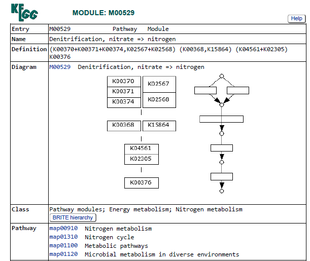{width=75%}

From the output of anvi-estimate-metabolism, we can look for the KEGG module for Denitrification (M00529) and look at its completeness:

| KEGG Module | Station   | stepwise_module_completeness | pathwise_module_completeness |
|------------|-----------|--------------|------------|
| M00529     | Station_1 | 1.00         | 1.00       |
| M00529     | Station_2 | 1.00         | 1.00       |
| M00529     | Station_3 | 1.00         | 1.00       |

So all the genes required for denitrification to occur seem to be detected at each of the stations.

Let's look at the denitrification pathway in more details using anvi-interactive, so we can see the coverage of the genes involved in denitrification across the 3 depths in the stations.

First, we need to create an anvi'o collection that contains all the denitrification genes. Using **anvi-export-functions** we can get the *gene_callers_ids* matching your *KO IDs*, then we can get the contigs name using **anvi-export-table --table genes_in_contigs**. After that we need to use *join* to find the contigs that have the genes of interest and finally we need to add "_split_00001" to each contig name (because in this case each contig has only one split as these come from metaT assembly. We ad a column with the name of our bin and then can import that using **anvi-import-collection** 

### Station 1

```{bash}
#| eval: false   
#| echo: true
anvi-export-functions   -c St1_contigs.db   -o St1_gene_functions.tsv
anvi-export-table --table genes_in_contigs -o St1_genes_in_contigs.tsv St1_contigs.db
tail -n +2 St1_genes_in_contigs.tsv | cut -f1,2 > gene_to_contig.tsv

# KO list for denitrification (edit/add as needed)
KOS='K00370|K00371|K00374|K02567|K02568|K00368|K15864|K04561|K02305|K00376'
# Get unique gene_callers_id hits for those KOs
awk -F'\t' -v kos="$KOS" '($3 ~ kos){print $1}' St1_gene_functions.tsv   | sort -u > genes_of_interest.ids
join -t $'\t' genes_of_interest.ids gene_to_contig.tsv   | cut -f2   | sort -u > contigs_of_interest.txt
awk '{print $1"_split_00001\tdenitrification"}' contigs_of_interest.txt   > denitrification_splits_collection.tsv

anvi-import-collection   -p St1_MERGED/PROFILE.db   -c St1_contigs.db   -C denitrification_splits denitrification_splits_collection.tsv
```

Now that we have an anvio collection, we need to "split" it from the main contigs and profile databases (we create a subset). This is because our initial contigs.be has too many splits (1,432,906 splits to be precise) and hierarchical clustering gets turned off.

Once it is splitted we can find a directory called "denitrifications_splits" in which we find a contigs and profile database that we can now plot using anvi-interactive.

First, we will import the data about the presence/absence of the genes of interest (from Module M00529) so we can visualise where they are found.

```{bash}
#| eval: false   
#| echo: true
anvi-export-functions   -c CONTIGS.db   -o gene_functions.tsv
anvi-export-table --table genes_in_contigs -o genes_in_contigs.tsv CONTIGS.db

# 1) Define your KO list (space-separated)
KOS="K00370 K00371 K00374 K02567 K02568 K00368 K15864 K04561 K02305 K00376"

# 2) Build gene-level KO presence/absence from gene_functions.tsv (KO is column 3)
awk -F'\t' -v OFS='\t' -v kos="$KOS" '
BEGIN{
    n = split(kos, k, " ")
    for (i=1; i<=n; i++) KO[k[i]] = 1
    printf "gene_callers_id"
    for (i=1; i<=n; i++) printf "%s%s", OFS, k[i]
    printf "\n"
}
NR==1 { next }  # skip header
{
    gene = $1
    acc  = $3
    genes[gene] = 1
    if (acc in KO) present[gene, acc] = 1
}
END{
    for (g in genes) {
        printf "%s", g
        for (i=1; i<=n; i++) {
            ko = k[i]
            v = ((g SUBSEP ko) in present) ? 1 : 0
            printf "%s%d", OFS, v
        }
        printf "\n"
    }
}
' gene_functions.tsv > KO_presence_absence_by_gene.tsv

# 3) Map gene_callers_id -> contig (requires genes_in_contigs.tsv from anvi-export-gene-calls)
#    Then collapse to contig-level by OR (max) across genes
awk -F'\t' -v OFS='\t' '
NR==FNR {
    if (FNR==1) next
    gene2contig[$1] = $2
    next
}
FNR==1 { print "contig", substr($0, index($0, "\t")+1); ncol=NF; next }
{
    gene = $1
    contig = (gene in gene2contig) ? gene2contig[gene] : "NA"
    contigs[contig]=1
    for (i=2; i<=NF; i++) if ($i==1) M[contig, i]=1
}
END{
    for (c in contigs) {
        printf "%s", c
        for (i=2; i<=ncol; i++) {
            v = ((c SUBSEP i) in M) ? 1 : 0
            printf "%s%d", OFS, v
        }
        printf "\n"
    }
}
' genes_in_contigs.tsv KO_presence_absence_by_gene.tsv > KO_presence_absence_by_contig.tsv

# 4) Convert contig names to split names (naive: appends _split_00001)
awk -F'\t' -v OFS='\t' '
FNR==1 { $1="item_name"; print; next }
{ $1 = $1 "_split_00001"; print }
' KO_presence_absence_by_contig.tsv > KO_presence_absence_by_split.tsv

# Import the data to the PROFILE.db
anvi-import-misc-data -p PROFILE.db -t items KO_presence_absence_by_split.tsv

```

#### anvi'o interactive plot - Denitrification

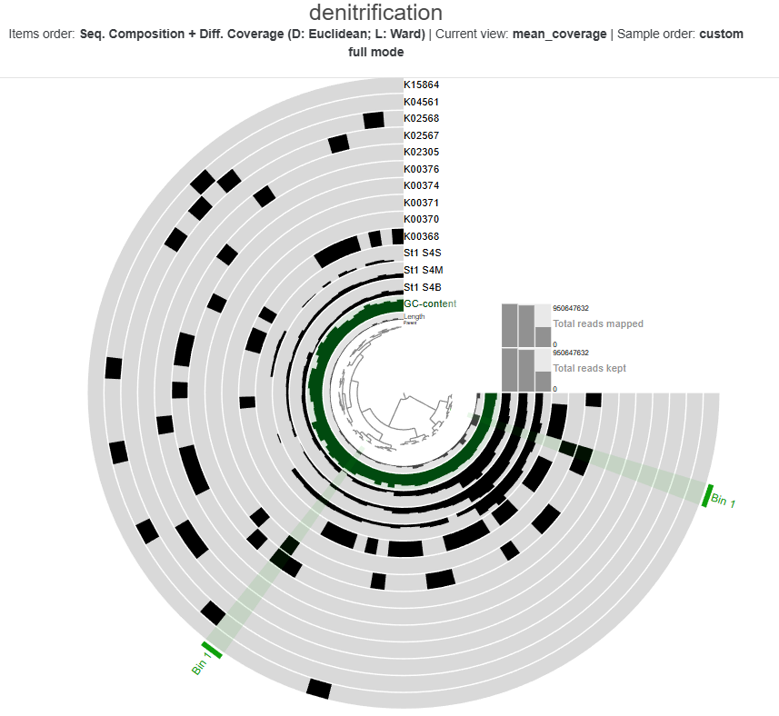{width=100%}

From this plot we see that:

  1) K00370 (narG) and K00371 (narH) are annotated on the same transcript (bin 1 on figure) which makes sense as they are subunits of the same nitrate reductase enzyme complex. In many bacterial genomes, narG and narH are directly adjacent and commonly co-transcribed as part of a nitrate reductase operon. For example, in E. coli the nar operon appears to contain four genes designated narGHJI (<https://pmc.ncbi.nlm.nih.gov/articles/PMC211023/pdf/jbacter00182-0317.pdf>).Operons are typically transcribed as one long mRNA. Hence, having multiple functions on one transcript here is not surprising.
  
  2) Transcripts are annotated with the same gene multiple times. Different microbial populations likely have slightly different sequences for these genes, hence they get assembled into multiple different versions instead of collapsed by the assembler into one sequence. Hence, having multiple transcript with the same function is not surprising.
  
From the coverage data layers, we can see that all the transcripts have coverage from sample S4B (Bottom) and most for sample S4M (Mid-water) but some might be missing from sample S4S (Surface). Therefore, let's look at the completeness of denitrification per depth instead of for the whole station.

```{bash}
#| eval: false   
#| echo: true
anvi-estimate-metabolism -c CONTIGS.db -p PROFILE.db -O denitrification_meta --add-coverage
```

From the output table we see that, the denitrification module (M00529) shows differences in both abundance (average coverage) and completeness (average detection) across samples. St1_S4S exhibits substantially lower coverage and detection, indicating a reduced presence and/or partial representation of the denitrification pathway in the surface sample. In contrast, St1_S4M and St1_S4B show much higher coverage and detection values, consistent with a more abundant and more complete denitrification potential in deeper waters. Notably, St1_S4B shows the highest detection, suggesting the most complete representation of the pathway among the three samples. Given that denitrification is surely happening in the sediments, this result makes sense.

| Sample   | Avg. Coverage | Avg. Detection |
|----------|---------------|---------------|
| St1_S4S  | 975.53        | 0.454         |
| St1_S4M  | 2032.39       | 0.787         |
| St1_S4B  | 1706.59       | 0.859         |

The table below provides a gene-level breakdown of the denitrification module (KEGG M00529), linking each predicted gene (Gene_ID) to its corresponding KEGG Ortholog (KO) and its sequencing coverage in three samples (St1_S4B, St1_S4M, and St1_S4S).

```{r}
library(tidyverse)
library(kableExtra)

st1_cov <- read.csv("data/St1_denitrification_enzymes_coverages.csv") |>
  mutate(across(contains("coverage"), ~ round(.x, 2)))

st1_cov |>
  kbl() |>
  kable_styling(full_width = FALSE) |>
  scroll_box(height = "400px")
```

Multiple gene copies are associated with several key denitrification steps, indicating some degree of functional redundancy within the pathway. Gene coverages are generally higher in St1_S4B and St1_S4M than in St1_S4S, where several components show low or zero coverage, suggesting a reduced or incomplete representation of the pathway in this sample. A small number of genes display particularly high coverage, implying that certain denitrification functions may be more prevalent than others across the dataset.

Now using the table above, we can list for each sample the Gene_IDs and KOs with nonzero coverage and we can turn that list into into an enzymes-txt file which can be used to calculated the denitrification completeness score for each sample, using:

```{bash}
#| eval: false   
#| echo: true
anvi-estimate-metabolism --enzymes-txt
```

| Sample | Module | Step | Path | Unique_prop | Unique_enzymes | Hits |
|:------|:------|----:|----:|----:|:----------------|:-----|
| St1_S4S | M00529 | 1 | 1 | 1 | K00376, K02305, K04561 | 3, 1, 2 |
| St1_S4M | M00529 | 1 | 1 | 1 | K00376, K02305, K04561 | 6, 2, 5 |
| St1_S4B | M00529 | 1 | 1 | 1 | K00376, K02305, K04561 | 7, 2, 5 |

All three samples (St1_S4S, St1_S4M, and St1_S4B) show complete denitrification pathways according to both stepwise and pathwise KEGG module criteria, indicating that all required enzymatic steps from nitrate to N₂ are represented.

The number of hits for the unique enzymes differs among samples. St1_S4B and St1_S4M show higher hit counts for most of the unique enzymes compared to St1_S4S, suggesting that these functions are represented by more gene transcripts or more abundant RNAs in these samples.

Together, these results suggest that the denitrification pathways is fully expressed in all three samples, but its relative transcription representation appears to be lower in St1_S4S than in St1_S4M and St1_S4B.

### Station 2

#### anvi'o interactive plot - Denitrification

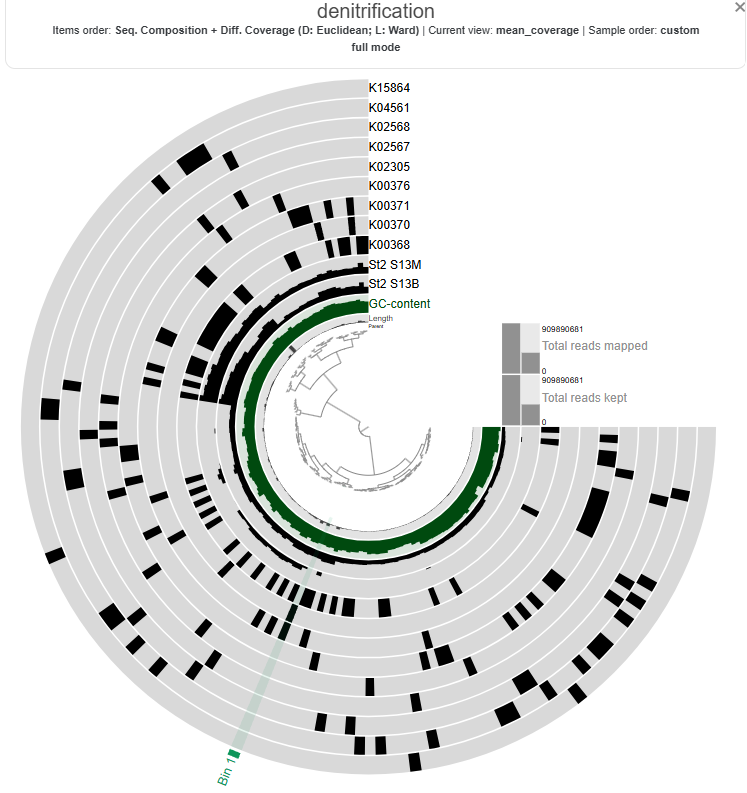{width=100%}

```{bash}
#| eval: false   
#| echo: true
anvi-estimate-metabolism -c CONTIGS.db -p PROFILE.db -O denitrification_meta --add-coverage
```


Station 2 - denitrification module (M00529) - Overall Coverage and Detection

| Sample   | Avg. Coverage | Avg. Detection |
|----------|---------------|---------------|
| St2_S13M  | 591.48       | 0.267         |
| St2_S13B  | 744.24       | 0.987        |

```{r}
st2_cov <- read.csv("data/St2_denitrification_enzymes_coverages.csv") |>
  mutate(across(contains("coverage"), ~ round(.x, 2)))

st2_cov |>
  kbl() |>
  kable_styling(full_width = FALSE) |>
  scroll_box(height = "400px")
```

| Sample | Module | Step | Path | Unique_prop | Unique_enzymes | Hits |
|:------|:------|----:|----:|----:|:----------------|:-----|
| St2_S13M | M00529 | 1 | 1 | 1 | K00376, K02305, K04561 | 2, 6, 8    |
| St2_S13B | M00529 | 1 | 1 | 1 | K00376, K02305, K04561 | 24, 11, 23 |

### Station 3

#### anvi'o interactive plot - Denitrification

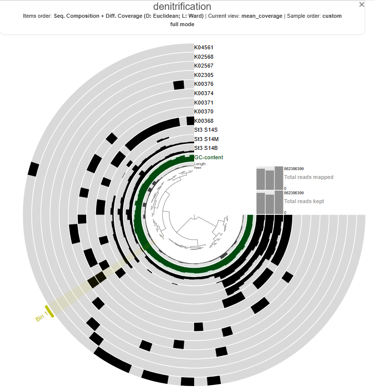{width=100%}


Station 3 - denitrification module (M00529) - Overall Coverage and Detection

| Sample   | Avg. Coverage | Avg. Detection |
|----------|---------------|---------------|
| St3_S14S  | 575.89       | 0.363         |
| St3_S14M  | 3178.61      | 0.626         |
| St3_S14B  | 1897.44      | 0.910         |

```{r}
st3_cov <- read.csv("data/St3_denitrification_enzymes_coverages.csv") |>
  mutate(across(contains("coverage"), ~ round(.x, 2)))

st3_cov |>
  kbl() |>
  kable_styling(full_width = FALSE) |>
  scroll_box(height = "400px")
```


| Sample | Module | Step | Path | Unique_prop | Unique_enzymes | Hits |
|:------|:------|----:|----:|----:|:----------------|:-----|
| St3_S14S | M00529 | 0.5 | 0.5 | NA | No enzymes unique to module  | NA   |
| St3_S14M | M00529 | 0.75 | 0.875 | 1 | K00376, K04561 | 1, 2 |
| St3_S14B | M00529 | 1 | 1 | 1 | K00376, K02305, K04561 | 3, 2, 8 |

::: {.callout-note title="Depth-related patterns in denitrification potential at Station 3"}

The completeness of the KEGG denitrification module (M00529; nitrate → N₂) increased with depth at Station 3, indicating a clear vertical gradient in the transcript presence/abundance for this pathway. In the **surface sample (St3_S14S)**, the module showed low completeness (stepwise = 0.5, pathwise = 0.5), suggesting that only partial denitrification steps, such as nitrate or nitrite reduction, may be present in the community. The absence of enzymes unique to the module further indicates that the full denitrification pathway is likely incomplete at this depth.

In contrast, the **mid-water sample (St3_S14M)** exhibited higher completeness (stepwise = 0.75, pathwise = 0.875), with detection of enzymes specific to the later stages of denitrification, including nitric oxide reductase (K04561) and nitrous oxide reductase (K00376). This suggests that organisms capable of performing most steps of denitrification are present in the mid-water microbial community.

The **bottom sample (St3_S14B)** showed full pathway completeness (stepwise = 1, pathwise = 1), with multiple hits for enzymes involved in the terminal steps of denitrification. The detection of key enzymes such as nitrous oxide reductase (K00376) and nitric oxide reductase (K02305, K04561) indicates that the microbial community likely possesses the capacity to carry out complete denitrification, potentially converting nitrate to dinitrogen gas.

Overall, these results suggest a **depth-dependent increase in denitrification potential**, with incomplete or partial pathways in surface waters and a fully represented pathway in deeper layers. This pattern suggests that denitrification is influenced by the proximity with the sediments and/or with the amount of particles which relates to the fact that denitrification becomes more favorable under **low-oxygen or anoxic conditions**.

:::

### Summary

denitrification pathway steps:

**NO₃⁻ → NO₂⁻ → NO → N₂O → N₂**

Typical KO groups:

| Step              | Enzyme                  | Gene            | KO             |
| ----------------- | ----------------------- | --------------- | -------------- |
| Nitrate → Nitrite | Nitrate reductase       | **narG / napA** | K00370, K02567 |
| Nitrite → NO      | Nitrite reductase       | **nirK / nirS** | K00368, K15864 |
| NO → N₂O          | Nitric oxide reductase  | **norB**        | K04561         |
| N₂O → N₂          | Nitrous oxide reductase | **nosZ**        | K00376         |
| Accessory         | nos genes               | **nosD/F/Y**    | K02305         |


| Sample   | Avg Coverage | Avg Detection | Stepwise Completeness | Pathwise Completeness | Unique Prop. | Unique Enzymes (hit)                        | 
| -------- | -----------: | ------------: | --------------------: | --------------------: | -----------: | ------------------------------------- |
| St1_S4S  |       975.53 |         0.454 |                  1.00 |                  1.00 |            1 | K00376 (3), K02305 (1), K04561 (2)    |
| St1_S4M  |      2032.39 |         0.787 |                  1.00 |                  1.00 |            1 | K00376 (6), K02305 (2), K04561 (5)    | 
| St1_S4B  |      1706.59 |         0.859 |                  1.00 |                  1.00 |            1 | K00376 (7), K02305 (2), K04561 (5)    | 
| St2_S13M |       591.48 |         0.267 |                  1.00 |                  1.00 |            1 | K00376 (2), K02305 (6), K04561 (8)    | 
| St2_S13B |       744.24 |         0.987 |                  1.00 |                  1.00 |            1 | K00376 (24), K02305 (11), K04561 (23) | 
| St3_S14S |       575.89 |         0.363 |                  0.50 |                  0.50 |           NA | No enzymes unique to module           | 
| St3_S14M |      3178.61 |         0.626 |                  0.75 |                 0.875 |            1 | K00376 (1), K04561 (2)                |
| St3_S14B |      1897.44 |         0.910 |                  1.00 |                  1.00 |            1 | K00376 (3), K02305 (2), K04561 (8)    |

#### Heatmap of denitrification gene coverage across stations and depths.

```{r, echo=FALSE, message=FALSE, warning=FALSE, fig.width=8, fig.height=5}
st1 <- st1_cov %>%
  group_by(KO) %>%
  summarise(
    St1_S4B = sum(St1_S4B_coverage),
    St1_S4M = sum(St1_S4M_coverage),
    St1_S4S = sum(St1_S4S_coverage)
  )

st2 <- st2_cov %>%
  group_by(KO) %>%
  summarise(
    St2_S13B = sum(St2_S13B_coverage),
    St2_S13M = sum(St2_S13M_coverage)
  )

st3 <- st3_cov %>%
  group_by(KO) %>%
  summarise(
    St3_S14B = sum(St3_S14B_coverage),
    St3_S14M = sum(St3_S14M_coverage),
    St3_S14S = sum(St3_S14S_coverage)
  )

heatmap_df <- st1 %>%
  full_join(st2, by = "KO") %>%
  full_join(st3, by = "KO")

heatmap_df[is.na(heatmap_df)] <- 0

heatmap_matrix <- heatmap_df %>%
  column_to_rownames("KO") %>%
  as.matrix()

heatmap_matrix <- log10(heatmap_matrix + 1)

ko_order <- c(
  "K00370",
  "K00371",
  "K00374",
  "K02567",
  "K02568",
  "K00368",
  "K15864",
  "K04561",
  "K02305",
  "K00376"
)

heatmap_matrix <- heatmap_matrix[ko_order, , drop = FALSE]

gene_annotation <- data.frame(
  Step = c(
    "Nitrate reduction",
    "Nitrate reduction",
    "Nitrate reduction",
    "Nitrate reduction",
    "Nitrate reduction",
    "Nitrite reduction",
    "Nitrite reduction",
    "NO reduction",
    "NO reduction",
    "N2O reduction"
  )
)

rownames(gene_annotation) <- ko_order

gene_annotation$Step <- factor(
  gene_annotation$Step,
  levels = c(
    "Nitrate reduction",
    "Nitrite reduction",
    "NO reduction",
    "N2O reduction"
  )
)

ann_colors <- list(
  Step = c(
    "Nitrate reduction" = "#d97ce8",
    "Nitrite reduction" = "#00c98b",
    "NO reduction"      = "#22b7e8",
    "N2O reduction"     = "#f28e8e"
  )
)

sample_order <- c(
  "St1_S4S", "St1_S4M", "St1_S4B",
  "St2_S13M", "St2_S13B",
  "St3_S14S", "St3_S14M", "St3_S14B"
)

heatmap_matrix <- heatmap_matrix[, sample_order]

library(pheatmap)

pheatmap(
  heatmap_matrix,
  cluster_rows = FALSE,
  cluster_cols = FALSE,
  annotation_row = gene_annotation,
  annotation_colors = ann_colors,
  border_color = NA,
  gaps_col = c(3, 5)
)

```

Values correspond to log-transformed gene coverage

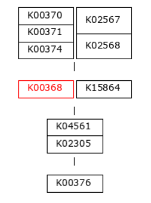

::: {.callout-note title="Discussion"}

The heatmap shows the distribution and relative expression of denitrification-related KEGG orthologs (KO) genes across the stations and depth layers. Overall, the results indicate substantial spatial variability in the transcription of denitrification genes across the study area.

**Nitrate reduction genes**

The first step of denitrification, the reduction of nitrate to nitrite, can be catalyzed by two distinct enzymatic systems: the **membrane-bound nitrate reductase (Nar)** and the **periplasmic nitrate reductase (Nap)**. In this dataset, the Nar pathway is represented by **K00370, K00371, and K00374**, while the Nap pathway is represented by **K02567 and K02568** (see pathway diagram above).

At **Station 1**, transcripts from both nitrate reduction systems (Nar and Nap) are detected.At **Station 2**, K00374 is absent, indicating only partial expression of the Nar-associated genes detected in this dataset, while with both the Nap genes K02567 and K02568, the Nap pathwa is complete. In contrast, **Station 3** shows limited expression of Nar genes and Nap-associated transcripts are absent, indicating reduced transcription of nitrate-to-nitrite reduction pathways at this station. 

**Nitrite reduction genes**

Genes associated with the reduction of nitrite to nitric oxide are represented by **K00368 (nirK)** and **K15864 (nirS)**, which encode alternative nitrite reductases (the presence of only one transcript is enough). The gene of nirK exhibits the highest coverage across samples, indicating that the conversion of nitrite to nitric oxide may represent a dominant step in the denitrification pathway in these samples. In contrast, nirS shows considerably lower expression, suggesting a predominance of nirK-type denitrifiers in the active microbial assemblages.

**Nitric oxide reduction genes**

Genes involved in the reduction of nitric oxide to nitrous oxide are represented by **K04561 (norB)** and **K02305 (norC)**, which are associated with the nitric oxide reductase system. The heatmap shows moderate transcript coverage at Stations 1 and 2, with the highest expression observed in the mid-water and bottom samples at Station 2. This suggests that the nitric oxide reduction step of denitrification is actively transcribed at Stations 1 and 2, particularly in deeper waters, whereas expression of nitric oxide reductase genes appears to be minimal at Station 3.

**Nitrous oxide reduction gene**

The final step of denitrification, the reduction of nitrous oxide to dinitrogen gas, is represented by **K00376 (nosZ)**, alone. Transcripts of this gene are detected primarily at Stations 1 and 2, indicating that microorganisms capable of reducing nitrous oxide may be transcriptionally active in these environments. However, expression levels remain relatively moderate compared with earlier steps of the pathway, and transcripts are largely absent at Station 3, suggesting limited expression of this step at that station.

**Depth-related patterns**

Across Stations 1 and 2, several denitrification genes exhibit higher transcript levels in mid-water and bottom samples compared to surface waters, suggesting that denitrification activity may be enhanced in deeper parts of the water column.
:::

## Anammox (anaerobic ammonium oxidation) - KEGG Module M00973

Overall process:
**nitrite + ammonia → nitrogen gas**

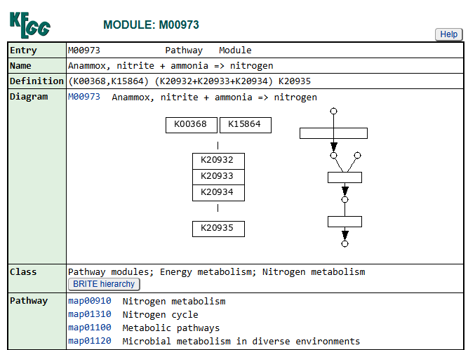{width=75%}

| Step | Requirement                  | Function                   |
| ---- | ---------------------------- | -------------------------- |
| 1    | **K00368 OR K15864**         | Nitrite reduction          |
| 2    | **K20932 + K20933 + K20934** | Hydrazine synthase complex |
| 3    | **K20935**                   | Hydrazine dehydrogenase    |

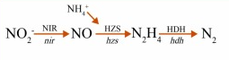{width=50%}

Let's do the same workflow as for denitrification.

From the output of anvi-estimate-metabolism, we can look for the KEGG module for Anammox (M00973) and look at its completeness for each of the stations:

| KEGG Module | Station   | stepwise_module_completeness | pathwise_module_completeness |
|------------|-----------|--------------|------------|
| M00973     | Station_1 | 0.33         | 0.33       |
| M00973     | Station_2 | 0.33         | 0.55       |
| M00973     | Station_3 | 0.33         | 0.55       |

The KEGG module for anaerobic ammonium oxidation (anammox; M00973) was incomplete at all three sampling stations. While transcripts associated with nitrite reduction (K00368 and/or K15864) were detected across the datasets, the key hydrazine synthase complex and hydrazine dehydrogenase required for a functional anammox pathway were not fully present. Stepwise module completeness was therefore low (0.33) for all stations, indicating no transcript evidence for a complete anammox pathway in these samples (Table 1).

**Table 1. Presence of key genes/transcripts associated with the anammox pathway (KEGG module M00973) across the three stations.**

| Gene (KO)       | Function                     | Station 1 | Station 2 | Station 3 |
| --------------- | ---------------------------- | --------- | --------- | --------- |
| K00368 / K15864 | Nitrite reduction            | ✓         | ✓         | ✓         |
| K20932          | Hydrazine synthase subunit A | ✗         | ✓         | ✓         |
| K20933          | Hydrazine synthase subunit B | ✗         | ✗         | ✗         |
| K20934          | Hydrazine synthase subunit C | ✗         | ✓         | ✓         |
| K20935          | Hydrazine dehydrogenase      | ✗         | ✗         | ✗         |

The absence of both the complete hydrazine synthase complex (subunit A, B and C) and the hydrazine dehydrogenase suggests that the canonical anammox pathway is not supported by the metatranscriptomics data at any of the sampled stations.

Still, let's look at the distribution of these genes/transcripts across the differents depths of our 3 stations.

::: {.callout-note title="Note"}
The nitrite reductase genes (K00368 or K15864) detected in the samples are shared between anammox and denitrification pathways.
:::

### Station 1

```{bash}
#| eval: false   
#| echo: true

# KO list for anammox-specific genes
KOS='K00368|K15864|K20932|K20933|K20934|K20935'

# Get unique gene_callers_id hits for those KOs
awk -F'\t' -v kos="$KOS" '($3 ~ kos){print $1}' St1_gene_functions.tsv \
  | sort -u > genes_of_interest.ids
  
sort -k1,1 gene_to_contig.tsv > gene_to_contig.sorted.tsv

join -t $'\t' genes_of_interest.ids gene_to_contig.sorted.tsv \
  | cut -f2 \
  | sort -u > contigs_of_interest.txt

awk '{print $1"_split_00001\tanammox"}' contigs_of_interest.txt \
  > anammox_splits_collection.tsv

anvi-import-collection \
  -p St1_MERGED/PROFILE.db \
  -c St1_contigs.db \
  -C anammox_splits \
  anammox_splits_collection.tsv
```

```{bash}
#| eval: false   
#| echo: true
anvi-export-functions   -c CONTIGS.db   -o gene_functions.tsv
anvi-export-table --table genes_in_contigs -o genes_in_contigs.tsv CONTIGS.db

# 1) Define your KO list (space-separated)
KOS="K00368 K15864 K20932 K20933 K20934 K20935"

# 2) Build gene-level KO presence/absence from gene_functions.tsv (KO is column 3)
awk -F'\t' -v OFS='\t' -v kos="$KOS" '
BEGIN{
    n = split(kos, k, " ")
    for (i=1; i<=n; i++) KO[k[i]] = 1
    printf "gene_callers_id"
    for (i=1; i<=n; i++) printf "%s%s", OFS, k[i]
    printf "\n"
}
NR==1 { next }  # skip header
{
    gene = $1
    acc  = $3
    genes[gene] = 1
    if (acc in KO) present[gene, acc] = 1
}
END{
    for (g in genes) {
        printf "%s", g
        for (i=1; i<=n; i++) {
            ko = k[i]
            v = ((g SUBSEP ko) in present) ? 1 : 0
            printf "%s%d", OFS, v
        }
        printf "\n"
    }
}
' gene_functions.tsv > KO_presence_absence_by_gene.tsv

# 3) Map gene_callers_id -> contig (requires genes_in_contigs.tsv from anvi-export-gene-calls)
#    Then collapse to contig-level by OR (max) across genes
awk -F'\t' -v OFS='\t' '
NR==FNR {
    if (FNR==1) next
    gene2contig[$1] = $2
    next
}
FNR==1 { print "contig", substr($0, index($0, "\t")+1); ncol=NF; next }
{
    gene = $1
    contig = (gene in gene2contig) ? gene2contig[gene] : "NA"
    contigs[contig]=1
    for (i=2; i<=NF; i++) if ($i==1) M[contig, i]=1
}
END{
    for (c in contigs) {
        printf "%s", c
        for (i=2; i<=ncol; i++) {
            v = ((c SUBSEP i) in M) ? 1 : 0
            printf "%s%d", OFS, v
        }
        printf "\n"
    }
}
' genes_in_contigs.tsv KO_presence_absence_by_gene.tsv > KO_presence_absence_by_contig.tsv

# 4) Convert contig names to split names (naive: appends _split_00001)
awk -F'\t' -v OFS='\t' '
FNR==1 { $1="item_name"; print; next }
{ $1 = $1 "_split_00001"; print }
' KO_presence_absence_by_contig.tsv > KO_presence_absence_by_split.tsv

# Import the data to the PROFILE.db
anvi-import-misc-data -p PROFILE.db -t items KO_presence_absence_by_split.tsv
```

#### anvi'o interactive plot - Anammox

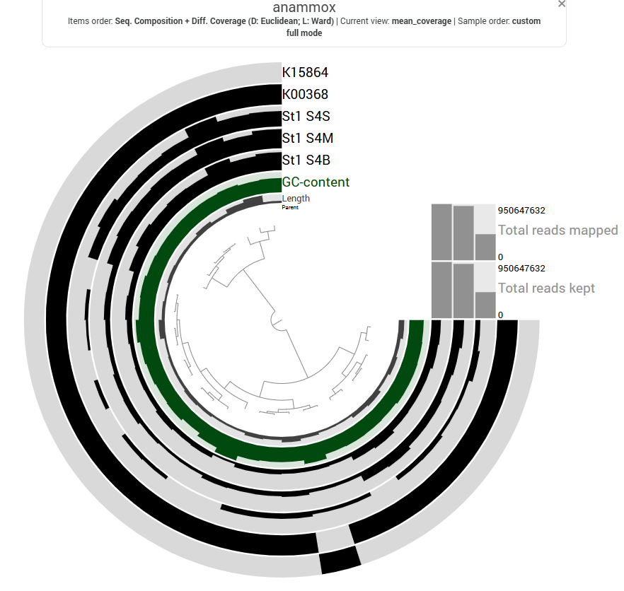{width=100%}

```{bash}
#| eval: false   
#| echo: true
anvi-estimate-metabolism -c CONTIGS.db -p PROFILE.db -O anammox_meta --add-coverage
```

| Sample   | Avg. Coverage | Avg. Detection |
|----------|---------------|---------------|
| St1_S4S  | 1830.53        | 0.480         |
| St1_S4M  | 3567.58       | 0.875         |
| St1_S4B  | 2771.32       | 0.926         |

The table below provides a gene-level breakdown of the anammox module, linking each predicted gene (Gene_ID) to its corresponding KEGG Ortholog (KO) and its sequencing coverage in three samples (St1_S4B, St1_S4M, and St1_S4S).

```{r}
library(tidyverse)
library(kableExtra)

st1_cov <- read.csv("data/St1_anammox_enzymes_coverages.csv") |>
  mutate(across(contains("coverage"), ~ round(.x, 2)))

st1_cov |>
  kbl() |>
  kable_styling(full_width = FALSE) |>
  scroll_box(height = "400px")
```

Now using the table above, we can list for each sample the Gene_IDs and KOs with nonzero coverage and we can turn that list into into an enzymes-txt file which can be used to calculated the anammox completeness score for each sample, using:

```{bash}
#| eval: false   
#| echo: true
anvi-estimate-metabolism --enzymes-txt
```

| Sample | Module | Step | Path | Unique_prop | Unique_enzymes | Hits |
|:------|:------|----:|----:|----:|:----------------|:-----|
| St1_S4S | M00973 | 0.33 | 0.33 | NA | No enzymes unique to module  | NA |
| St1_S4M | M00973 | 0.33 | 0.33 | NA | No enzymes unique to module  | NA |
| St1_S4B | M00973 | 0.33 | 0.33 | NA | No enzymes unique to module  | NA |


**IMPORTANT NOTE**: with no enzymes unique to module, the values of coverage and detection above are actually missleading as they inform us about enzymes that are also involved in order pathways than anammox. Probably it would be better to use only enzymes that are unique to modules for both denitrification and anammox! here we would have zero for coverage and detection of anammox given that none of the enzymes exclusively used in the pathway are present!

### Station 2

#### anvi'o interactive plot - Anammox

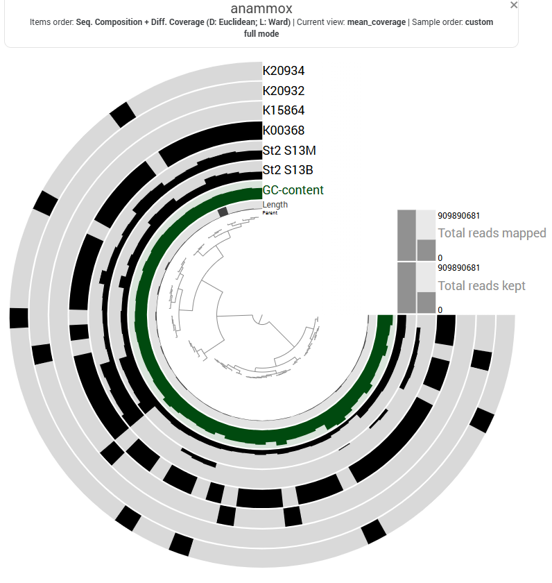{width=100%}

| Sample   | Avg. Coverage | Avg. Detection |
|----------|---------------|---------------|
| St2_S13M  | 1214.26       | 0.99         |
| St2_S13B  | 1293.10       | 0.40         |

The table below provides a gene-level breakdown of the anammox module, linking each predicted gene (Gene_ID) to its corresponding KEGG Ortholog (KO) and its sequencing coverage in the two samples of station 2 (St2_S13B and St2_S13M).

```{r}
st2_cov <- read.csv("data/St2_anammox_enzymes_coverages.csv") |>
  mutate(across(contains("coverage"), ~ round(.x, 2)))

st2_cov |>
  kbl() |>
  kable_styling(full_width = FALSE) |>
  scroll_box(height = "400px")
```

Now using the table above, we can list for each sample the Gene_IDs and KOs with nonzero coverage and we can turn that list into into an enzymes-txt file which can be used to calculated the anammox completeness score for each sample.

| Sample | Module | Step | Path | Unique_prop | Unique_enzymes | Hits |
|:------|:------|----:|----:|----:|:----------------|:-----|
| St2_S13M | M00973 | 0.33 | 0.55 | 1 | K20932, K20934  | 2, 5 |
| St2_S13B | M00973 | 0.33 | 0.55 | 1 | K20932, K20934  | 2, 7 |

### Station 3

#### anvi'o interactive plot - Anammox

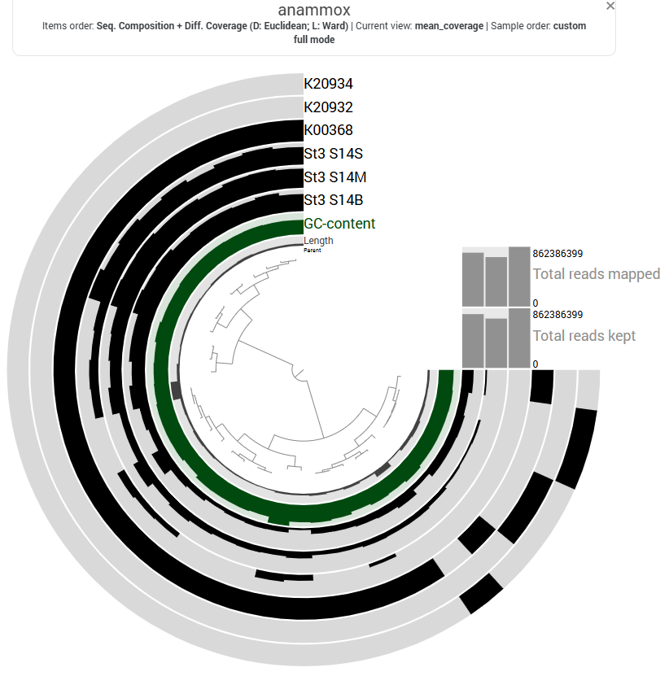{width=100%}

| Sample   | Avg. Coverage | Avg. Detection |
|----------|---------------|---------------|
| St3_S14S  | 1214.26       | 0.99         |
| St3_S14M  | 1214.26       | 0.99         |
| St3_S14B  | 1293.10       | 0.40         |

The table below provides a gene-level breakdown of the anammox module, linking each predicted gene (Gene_ID) to its corresponding KEGG Ortholog (KO) and its sequencing coverage in the two samples of station 2 (St2_S13B and St2_S13M).

```{r}
st3_cov <- read.csv("data/St3_anammox_enzymes_coverages.csv") |>
  mutate(across(contains("coverage"), ~ round(.x, 2)))

st3_cov |>
  kbl() |>
  kable_styling(full_width = FALSE) |>
  scroll_box(height = "400px")
```

Now using the table above, we can list for each sample the Gene_IDs and KOs with nonzero coverage and we can turn that list into into an enzymes-txt file which can be used to calculated the anammox completeness score for each sample.

| Sample | Module | Step | Path | Unique_prop | Unique_enzymes | Hits |
|:------|:------|----:|----:|----:|:----------------|:-----|
| St3_S14S | M00973 | 0.33 | 0.33 | NA | No enzymes unique to module  | NA |
| St3_S14M | M00973 | 0.33 | 0.55 | 1 | K20932, K20934  | 2, 2 |
| St3_S14B | M00973 | 0.33 | 0.55 | 1 | K20932, K20934  | 2, 3 |

### Summary

Anammox pathway steps:

**NO₂⁻ → NO → N₂H₄ → N₂**

In addition, NH₄⁺ is consumed in the key step:

**NO + NH₄⁺ → N₂H₄**

Typical KO groups:

| Step                   | Enzyme                  | Gene                   | KO                     |
| ---------------------- | ----------------------- | ---------------------- | ---------------------- |
| Nitrite → Nitric oxide | Nitrite reductase       | **nirK / nirS**        | K00368, K15864         |
| NO + NH₄⁺ → Hydrazine  | Hydrazine synthase      | **hzsA / hzsB / hzsC** | K20932, K20933, K20934 |
| Hydrazine → N₂         | Hydrazine dehydrogenase | **hdh**                | K20935                 |


| Sample   | Avg Coverage | Avg Detection | Stepwise Completeness | Pathwise Completeness | Unique Prop. | Unique Enzymes (hit) |
|----------|-------------|---------------|----------------------|----------------------|--------------|----------------------|
| St1_S4S  | 975.53  | 0.454 | 1.00 | 1.00 | 1 | K00376 (3), K02305 (1), K04561 (2) |
| St1_S4M  | 2032.39 | 0.787 | 1.00 | 1.00 | 1 | K00376 (6), K02305 (2), K04561 (5) |
| St1_S4B  | 1706.59 | 0.859 | 1.00 | 1.00 | 1 | K00376 (7), K02305 (2), K04561 (5) |
| St2_S13M | 591.48  | 0.267 | 1.00 | 1.00 | 1 | K00376 (2), K02305 (6), K04561 (8) |
| St2_S13B | 744.24  | 0.987 | 1.00 | 1.00 | 1 | K00376 (24), K02305 (11), K04561 (23) |
| St3_S14S | 575.89  | 0.363 | 0.50 | 0.50 | NA | No enzymes unique to module |
| St3_S14M | 3178.61 | 0.626 | 0.75 | 0.875 | 1 | K00376 (1), K04561 (2) |
| St3_S14B | 1897.44 | 0.910 | 1.00 | 1.00 | 1 | K00376 (3), K02305 (2), K04561 (8) |

#### Heatmap of anammox gene coverage across stations and depths.

```{r, echo=FALSE, message=FALSE, warning=FALSE, fig.width=8, fig.height=5}
st1 <- st1_cov %>%
  group_by(KO) %>%
  summarise(
    St1_S4B = sum(St1_S4B_coverage),
    St1_S4M = sum(St1_S4M_coverage),
    St1_S4S = sum(St1_S4S_coverage)
  )

st2 <- st2_cov %>%
  group_by(KO) %>%
  summarise(
    St2_S13B = sum(St2_S13B_coverage),
    St2_S13M = sum(St2_S13M_coverage)
  )

st3 <- st3_cov %>%
  group_by(KO) %>%
  summarise(
    St3_S14B = sum(St3_S14B_coverage),
    St3_S14M = sum(St3_S14M_coverage),
    St3_S14S = sum(St3_S14S_coverage)
  )

heatmap_df <- st1 %>%
  full_join(st2, by = "KO") %>%
  full_join(st3, by = "KO")

heatmap_df[is.na(heatmap_df)] <- 0

ko_order <- c("K00368", "K15864", "K20932", "K20933", "K20934", "K20935")

heatmap_df <- heatmap_df %>%
  tibble::add_row(KO = setdiff(ko_order, heatmap_df$KO)) %>%
  distinct(KO, .keep_all = TRUE)

heatmap_df[is.na(heatmap_df)] <- 0

heatmap_matrix <- heatmap_df %>%
  column_to_rownames("KO") %>%
  as.matrix()

heatmap_matrix <- log10(heatmap_matrix + 1)
heatmap_matrix <- heatmap_matrix[ko_order, , drop = FALSE]

gene_annotation <- data.frame(
  Step = c(
    "Nitrite reduction",
    "Nitrite reduction",
    "Hydrazine synthesis",
    "Hydrazine synthesis",
    "Hydrazine synthesis",
    "Hydrazine oxidation"
  )
)

rownames(gene_annotation) <- ko_order

gene_annotation$Step <- factor(
  gene_annotation$Step,
  levels = c(
    "Nitrite reduction",
    "Hydrazine synthesis",
    "Hydrazine oxidation"
  )
)

ann_colors <- list(
  Step = c(
    "Nitrite reduction"   = "#00c98b",
    "Hydrazine synthesis" = "#22b7e8",
    "Hydrazine oxidation" = "#f28e8e"
  )
)

sample_order <- c(
  "St1_S4S", "St1_S4M", "St1_S4B",
  "St2_S13M", "St2_S13B",
  "St3_S14S", "St3_S14M", "St3_S14B"
)

heatmap_matrix <- heatmap_matrix[, sample_order]

library(pheatmap)

pheatmap(
  heatmap_matrix,
  cluster_rows = FALSE,
  cluster_cols = FALSE,
  annotation_row = gene_annotation,
  annotation_colors = ann_colors,
  border_color = NA,
  gaps_row = c(2, 5),
  gaps_col = c(3, 5)
)

```

Values correspond to log-transformed gene coverage

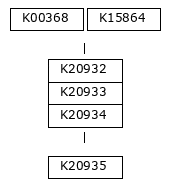


::: {.callout-note title="Discussion"}

The heatmap shows the distribution and relative expression of anammox-related KEGG orthologs (KO) genes across the stations and depth layers.

Transcripts corresponding to the **nitrite reduction genes K00368 and K15864** were detected in several samples, with **K00368 showing relatively high expression across all stations**. However, these genes are not specific to anammox metabolism and are also involved in other nitrogen cycling processes such as denitrification. Therefore, their expression alone does not indicate active anammox activity.

Transcripts corresponding to two subunits of the **hydrazine synthase complex (K20932 and K20934)** were detected in samples from Stations 2 and 3, particularly in deeper samples. Hydrazine synthase is a key enzyme unique to anammox metabolism, suggesting that transcripts related to this process are present in these communities. However, the K20933 subunit was not detected, and transcripts for hydrazine dehydrogenase (K20935), which catalyses the final step of the anammox pathway, were absent across all samples.

Because both the complete hydrazine synthase complex and hydrazine dehydrogenase are required for a functional anammox pathway, the metatranscriptomic data do not provide evidence for the full expression of the canonical anammox pathway in these samples. The detected transcripts may reflect partial expression of related enzymes, low-abundance anammox taxa, or homologous genes involved in other nitrogen transformation processes.

Overall, the results suggest that while some anammox-associated transcripts are present—particularly in deeper samples at Stations 2 and 3—the absence of key pathway components indicates that active anammox metabolism is unlikely to be fully expressed in these communities at the time of sampling.
:::

## Normalising gene coverages

Gene coverages were normalised using the housekeeping genes **rpoB and gyrB**, which encode the **β subunit of RNA polymerase** and **DNA gyrase**, respectively. These genes are typically present as **single-copy, core components of bacterial genomes** and are constitutively expressed, making them suitable proxies for baseline cellular transcriptional activity. Using the geometric mean of rpoB and gyrB provides a stable reference that accounts for variation in sequencing depth and community composition, while reducing bias associated with reliance on a single gene. This approach enables more robust comparison of denitrification and anammox gene expression across samples and depths within the water column.

```{bash}
#| eval: false   
#| echo: true
HK_KOS='K03043|K02470'

awk -F'\t' -v kos="$HK_KOS" '($3 ~ kos){print $1}' St1_gene_functions.tsv \
  | sort -u > housekeeping_genes.ids
  
join -t $'\t' housekeeping_genes.ids gene_to_contig.sorted.tsv \
  | cut -f2 \
  | sort -u > housekeeping_contigs.txt
  
anvi-export-gene-coverage-and-detection \
  -p St1_MERGED/PROFILE.db \
  -c St1_contigs.db \
  --genes-of-interest housekeeping_genes.ids \
  -O St1_housekeeping
  
# Let's do the same with the denitrification genes

anvi-export-gene-coverage-and-detection   -p St1_MERGED/PROFILE.db   -c St1_contigs.db   --genes-of-interest genes_of_interest.ids   -O St1_denitrification

```

```{r}
library(dplyr)
library(tidyr)
library(readr)

# read function annotations
functions <- read_tsv("St1_gene_functions.tsv", show_col_types = FALSE)

# read coverages
cov <- read_tsv("St1_anammox-GENE-COVERAGES.txt", show_col_types = FALSE)

# read detection
det <- read_tsv("St1_anammox-GENE-DETECTION.txt", show_col_types = FALSE)

# convert wide -> long
cov_long <- cov %>%
  pivot_longer(
    cols = -gene_callers_id,
    names_to = "sample",
    values_to = "coverage"
  )

det_long <- det %>%
  pivot_longer(
    cols = -gene_callers_id,
    names_to = "sample",
    values_to = "detection"
  )

target_gene_ids <- unique(cov_long$gene_callers_id)

functions_ko_target <- functions %>%
  filter(gene_callers_id %in% target_gene_ids) %>%
  filter(grepl("^K\\d+", accession)) %>%
  select(gene_callers_id, KO_ID = accession, `function`) %>%
  distinct()

# merge everything
final_table <- cov_long %>%
  left_join(det_long, by = c("gene_callers_id", "sample")) %>%
  left_join(functions_ko_target, by = "gene_callers_id", relationship = "many-to-many") %>%
  select(gene_callers_id, KO_ID, `function`, sample, coverage, detection)

write_tsv(final_table, "St1_anammox_final_table.tsv")
```

Same for the housekeeping genes:

```{r}

# read coverages
cov <- read_tsv("St2_housekeeping-GENE-COVERAGES.txt", show_col_types = FALSE)

# read detection
det <- read_tsv("St2_housekeeping-GENE-DETECTION.txt", show_col_types = FALSE)

# convert wide -> long
cov_long <- cov %>%
  pivot_longer(
    cols = -gene_callers_id,
    names_to = "sample",
    values_to = "coverage"
  )

det_long <- det %>%
  pivot_longer(
    cols = -gene_callers_id,
    names_to = "sample",
    values_to = "detection"
  )

target_gene_ids <- unique(cov_long$gene_callers_id)

functions_ko_target <- functions %>%
  filter(gene_callers_id %in% target_gene_ids) %>%
  filter(grepl("^K\\d+", accession)) %>%
  select(gene_callers_id, KO_ID = accession, `function`) %>%
  distinct()

# merge everything
final_table <- cov_long %>%
  left_join(det_long, by = c("gene_callers_id", "sample")) %>%
  left_join(functions_ko_target, by = "gene_callers_id", relationship = "many-to-many") %>%
  select(gene_callers_id, KO_ID, `function`, sample, coverage, detection)

write_tsv(final_table, "St2_housekeeping_final_table.tsv")
```


## Mapping transcripts to genomes of potential denitrifiers

The reference genomes listed in this table represent marine prokaryotes that are ecologically plausible contributors to denitrification in Arctic shelf waters such as the Chukchi Sea.


| Species                     | Phylum         | Class               | Ecological niche (marine)                | Denitrification relevance |
|-----------------------------|----------------|---------------------|------------------------------------------|---------------------------|
| Colwellia psychrerythraea   | Pseudomonadota | Gammaproteobacteria | Arctic / cold-adapted, particle-associated | narGHI, nirS, norB; often incomplete (N₂O-prone) |
| Shewanella baltica          | Pseudomonadota | Gammaproteobacteria | Cold coastal waters, redox-flexible        | nar/nap, partial denitrification common |
| Psychromonas arctica        | Pseudomonadota | Gammaproteobacteria | Psychrophilic, organic-matter associated   | Nitrate reduction, variable downstream steps |
| Marinobacter alkaliphilus   | Pseudomonadota | Gammaproteobacteria | Marine copiotroph, particle-associated     | nar/nap present in many strains |
| Planktomarina temperata     | Pseudomonadota | Alphaproteobacteria | Free-living, bloom-associated              | napAB, nirS/K, norB; variable nosZ |
| Sulfitobacter pontiacus     | Pseudomonadota | Alphaproteobacteria | Bloom-associated Rhodobacteraceae          | napAB, nirS/K, norB; occasional nosZ |

Mapping our RNA transcripts to the reference genomes of these marine prokarotes was not significant suggesting that these species were not abundant and/or active and/or detected. 


## Extraction of the community profile

According to this paper: <https://doi.org/10.1080/19490976.2024.2323235>, the best way to extract taxonomy from metaT reads is using the Kraken2/Bracken approach.

```{bash}
#| eval: false   
#| echo: true
kraken2 \
  --db /dssgfs01/scratch/ote_db/kraken/kraken_standard-16 \ 
  --threads 60 \ 
  --gzip-compressed \ 
  --report St1_S4S_report.txt \ 
  --output St1_S4S_kraken.out \ 
  --paired 1-S4S/1-S4S_RNA_clean_fwd.fq.gz 1-S4S/1-S4S_RNA_clean_rev.fq.gz
  
```

```{bash}
#| eval: false   
#| echo: true
bracken \
  -d /dssgfs01/scratch/ote_db/kraken/kraken_standard-16 \
  -i St1_S4S_report.txt \
  -o St1_S4S.bracken.F \
  -r 150 \
  -l F
```

```{bash}
#| eval: false   
#| echo: true
# 1) Convert Kraken2 output to Krona input
cut -f2,3 St1_S4S_kraken.out > St1_S4S.krona.tsv

# 2) Make the Krona HTML
ktImportTaxonomy -t 2 -m 3 -o St1_S4S_krona.html St1_S4S.krona.tsv
```


Approximately **17%** of metatranscriptomic reads could be taxonomically classified using Kraken2 with the standard database (16 GB). Krona plots were therefore generated using classified reads only, and complementary family-level profiles were produced using Bracken.

### Station 4

```{r}
library(readr)
library(dplyr)
library(ggplot2)
library(forcats)
library(scales)
library(purrr)

my_colors <- c(
  "#FF6666", "#8DD3C7", "#377EB8", "#4DAF4A",
  "#984EA3", "#A6D854", "#FFFF33", "#FF7F00",
  "#F781BF", "#999999", "#66C2A5", "#FC8D62",
  "#8DA0CB", "#E78AC3", "#FFD92F", "#E5C494",
  "#B3B3B3", "#A65628", "#FFFFB3", "#BEBADA",
  "#FB8072", "#80B1D3", "#FDB462"
)

top_n <- 20

# Order left-to-right: Surface -> Mid-water -> Bottom
samples <- c("1-S4S", "2-S4M", "3-S4B")

sample_labels <- c(
  "1-S4S" = "Surface",
  "2-S4M" = "Mid-water",
  "3-S4B" = "Bottom"
)

files <- file.path("data", paste0(samples, ".bracken.F"))

read_bracken <- function(f, sample) {
  read_tsv(f, show_col_types = FALSE) %>%
    # remove host at family level (Hominidae = 9604)
    filter(taxonomy_id != 9604) %>%
    mutate(sample = sample) %>%
    group_by(sample) %>%
    mutate(rel_abund = new_est_reads / sum(new_est_reads)) %>%
    ungroup()
}

br_all <- map2_dfr(files, samples, read_bracken)

# Global top 20 taxa across all samples
top_taxa <- br_all %>%
  group_by(name) %>%
  summarise(total = sum(rel_abund), .groups = "drop") %>%
  arrange(desc(total)) %>%
  slice_head(n = top_n) %>%
  pull(name)

br_plot <- br_all %>%
  mutate(taxon = if_else(name %in% top_taxa, name, "Other")) %>%
  group_by(sample, taxon) %>%
  summarise(rel_abund = sum(rel_abund), .groups = "drop")

# Order taxa in legend by overall abundance (Other last)
taxon_levels <- br_plot %>%
  group_by(taxon) %>%
  summarise(total = sum(rel_abund), .groups = "drop") %>%
  arrange(desc(total)) %>%
  pull(taxon)

taxon_levels <- c(setdiff(taxon_levels, "Other"), "Other")

br_plot <- br_plot %>%
  mutate(
    sample = factor(sample, levels = samples),
    taxon  = factor(taxon, levels = taxon_levels)
  )

# Named palette (top 20 colors + grey for Other)
palette_vals <- setNames(
  c(my_colors[1:top_n], "grey80"),
  c(taxon_levels[taxon_levels != "Other"], "Other")
)

ggplot(br_plot, aes(x = sample, y = rel_abund, fill = taxon)) +
  geom_col(width = 0.7) +
  scale_x_discrete(labels = sample_labels) +
  scale_fill_manual(values = palette_vals) +
  scale_y_continuous(labels = percent_format(accuracy = 1)) +
  labs(
    x = NULL,
    y = "Relative abundance (Bracken; classified reads)",
    fill = "Family"
  ) +
  theme_bw()

```

### Station 13

```{r}

# Order left-to-right: Surface -> Mid-water -> Bottom
samples <- c("5-S13M", "6-S13B")

top_n <- 20

sample_labels <- c(
  "5-S13M" = "Mid-water",
  "6-S13B" = "Bottom"
)

files <- file.path("data", paste0(samples, ".bracken.F"))

read_bracken <- function(f, sample) {
  read_tsv(f, show_col_types = FALSE) %>%
    # remove host at family level (Hominidae = 9604)
    filter(taxonomy_id != 9604) %>%
    mutate(sample = sample) %>%
    group_by(sample) %>%
    mutate(rel_abund = new_est_reads / sum(new_est_reads)) %>%
    ungroup()
}

br_all <- map2_dfr(files, samples, read_bracken)

# Global top 20 taxa across all samples
top_taxa <- br_all %>%
  group_by(name) %>%
  summarise(total = sum(rel_abund), .groups = "drop") %>%
  arrange(desc(total)) %>%
  slice_head(n = top_n) %>%
  pull(name)

br_plot <- br_all %>%
  mutate(taxon = if_else(name %in% top_taxa, name, "Other")) %>%
  group_by(sample, taxon) %>%
  summarise(rel_abund = sum(rel_abund), .groups = "drop")

# Order taxa in legend by overall abundance (Other last)
taxon_levels <- br_plot %>%
  group_by(taxon) %>%
  summarise(total = sum(rel_abund), .groups = "drop") %>%
  arrange(desc(total)) %>%
  pull(taxon)

taxon_levels <- c(setdiff(taxon_levels, "Other"), "Other")

br_plot <- br_plot %>%
  mutate(
    sample = factor(sample, levels = samples),
    taxon  = factor(taxon, levels = taxon_levels)
  )

# Named palette (top 20 colors + grey for Other)
palette_vals <- setNames(
  c(my_colors[1:top_n], "grey80"),
  c(taxon_levels[taxon_levels != "Other"], "Other")
)

ggplot(br_plot, aes(x = sample, y = rel_abund, fill = taxon)) +
  geom_col(width = 0.7) +
  scale_x_discrete(labels = sample_labels) +
  scale_fill_manual(values = palette_vals) +
  scale_y_continuous(labels = percent_format(accuracy = 1)) +
  labs(
    x = NULL,
    y = "Relative abundance (Bracken; classified reads)",
    fill = "Family"
  ) +
  theme_bw()

```
### Station 14

```{r}

# Order left-to-right: Surface -> Mid-water -> Bottom
samples <- c("7-S14S", "8-S14M", "9-S14B")

sample_labels <- c(
  "7-S14S" = "Surface",
  "8-S14M" = "Mid-water",
  "9-S14B" = "Bottom"
)

files <- file.path("data", paste0(samples, ".bracken.F"))

read_bracken <- function(f, sample) {
  read_tsv(f, show_col_types = FALSE) %>%
    # remove host at family level (Hominidae = 9604)
    filter(taxonomy_id != 9604) %>%
    mutate(sample = sample) %>%
    group_by(sample) %>%
    mutate(rel_abund = new_est_reads / sum(new_est_reads)) %>%
    ungroup()
}

br_all <- map2_dfr(files, samples, read_bracken)

# Global top 20 taxa across all samples
top_taxa <- br_all %>%
  group_by(name) %>%
  summarise(total = sum(rel_abund), .groups = "drop") %>%
  arrange(desc(total)) %>%
  slice_head(n = top_n) %>%
  pull(name)

br_plot <- br_all %>%
  mutate(taxon = if_else(name %in% top_taxa, name, "Other")) %>%
  group_by(sample, taxon) %>%
  summarise(rel_abund = sum(rel_abund), .groups = "drop")

# Order taxa in legend by overall abundance (Other last)
taxon_levels <- br_plot %>%
  group_by(taxon) %>%
  summarise(total = sum(rel_abund), .groups = "drop") %>%
  arrange(desc(total)) %>%
  pull(taxon)

taxon_levels <- c(setdiff(taxon_levels, "Other"), "Other")

br_plot <- br_plot %>%
  mutate(
    sample = factor(sample, levels = samples),
    taxon  = factor(taxon, levels = taxon_levels)
  )

# Named palette (top 20 colors + grey for Other)
palette_vals <- setNames(
  c(my_colors[1:top_n], "grey80"),
  c(taxon_levels[taxon_levels != "Other"], "Other")
)

ggplot(br_plot, aes(x = sample, y = rel_abund, fill = taxon)) +
  geom_col(width = 0.7) +
  scale_x_discrete(labels = sample_labels) +
  scale_fill_manual(values = palette_vals) +
  scale_y_continuous(labels = percent_format(accuracy = 1)) +
  labs(
    x = NULL,
    y = "Relative abundance (Bracken; classified reads)",
    fill = "Family"
  ) +
  theme_bw()

```


## Tara Oceans Arctic data as reference

### Rationale and overview

As no site-matched metagenomic data were available for these samples, a reference-based approach was adopted using publicly available metagenomic data from the Tara Oceans Arctic expedition (**Station 194**), representing the closest comparable marine Arctic microbial communities currently available.

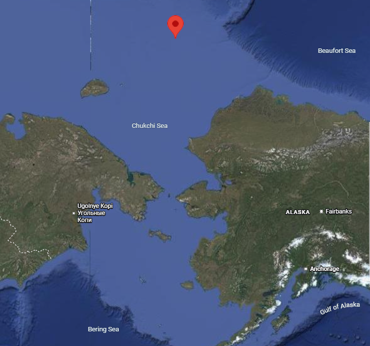
2:45 AM on September 8, 2013 (UTC)

### Station 194 - Tara Oceans Polar Circle expedition

| Field | Value |
|-------|-------|
| BioSamples ID | SAMEA4397903 |
| ENA Run ID | ERR3589571 |
| Date/Time | 2013-09-12T03:59:00Z |
| Latitude | 73.3275 |
| Longitude | -168.8142 |
| Depth | 35 |
| Layer | DCM |
| Size fraction | 0.22–3 |
| Region | Arctic Ocean |

link to the NCBI SRA (Sequence Read Archive) Run Browser metadata page for a specific run accession (ERR3589571): <https://trace.ncbi.nlm.nih.gov/Traces/index.html?view=run_browser&acc=ERR3589571&display=metadata>  

The EBI MGnify overview for analysis MGYA00607610 showing summary metadata and processed metagenomic results for a public datase is here: <https://www.ebi.ac.uk/metagenomics/analyses/MGYA00607610#overview> 
The assembly metadata is there: https://www.ebi.ac.uk/metagenomics/assemblies/ERZ7463204

This strategy enables the detection and quantification of expressed genes that are conserved between Arctic marine microbial communities, while acknowledging that locally specific taxa or gene variants not present in the reference dataset may not be captured.

### Assembly of Tara Oceans Arctic metagenomes

Raw metagenomic reads from the Tara Oceans Arctic expedition were assembled de novo using **MEGAHIT**, which is optimized for large and complex metagenomic datasets. The resulting assembly produced a set of contigs representing microbial genomic fragments present in Arctic marine surface waters.

These contigs were subsequently used as a reference database for read mapping. While the Tara Oceans sampling locations do not overlap geographically with the Chukchi Sea, they provide a comprehensive representation of Arctic marine microbial diversity and metabolic potential, particularly for conserved biogeochemical pathways such as nitrogen cycling.

### Metatranscriptomic read processing and mapping

Quality-filtered metatranscriptomic reads were mapped to the Tara Oceans Arctic contigs using **Bowtie2** with default end-to-end alignment settings. Mapping was performed in paired-end mode to improve alignment specificity. Both concordant and discordant alignments were reported, although downstream analyses focused on concordantly mapped read pairs.

**Mapping performance and alignment statistics**

Across samples, overall **alignment rates ranged from 15.8% to 27.3%** of paired-end reads mapping to the Tara Oceans Arctic contigs. The majority of reads aligned concordantly exactly once (11–18%), with a smaller proportion aligning to multiple locations (3–6%). Discordant alignments accounted for approximately 0.5–1% of read pairs.

These mapping rates are consistent with expectations for metatranscriptomic datasets mapped to non-site-matched metagenomic references, particularly in polar marine systems where microbial communities exhibit strong spatial structure and strain-level diversity. The observed alignment patterns suggest that a substantial fraction of expressed genes in the Chukchi Sea microbial community are shared with, or closely related to, those represented in the Tara Oceans Arctic metagenomes.

**Interpretation and limitations**

This reference-based approach enables the identification and relative quantification of expressed genes that are conserved across Arctic marine microbial communities, including key genes involved in nitrogen cycling. However, transcripts derived from locally unique taxa or divergent gene variants absent from the Tara Oceans reference assembly are unlikely to be captured, resulting in an underestimation of total transcript diversity and expression.

Consequently, analyses based on this approach focus on relative expression patterns of nitrogen-cycle gene families represented in the reference dataset, rather than absolute transcript abundances or the absence of specific metabolic pathways. Despite these limitations, the approach provides a robust framework for exploring nitrogen cycling activity in the Chukchi Sea in the absence of site-specific metagenomic data.

## Downloading MAGs from Station 194

Using the BioSamples ID (SAMEA4397903) in OMDB repository
<https://omdb.microbiomics.io/repository/ocean/genome-cols> we can download all the MAGs that have been generated from the data of station 194.

```{bash}
#| eval: false   
#| echo: true
# 1) Download the catalog of all genomes and files:
curl -O https://sunagawalab.ethz.ch/share/microbiomics/ocean/db/2.0/data/catalogs/OMDBv2.0_data.tsv.gz

# 2) Unzip it
gunzip OMDBv2.0_data.tsv.gz

# 3) Use it to download the MAGs associated with SAMEA4397903
grep "TARA_SAMEA4397903_MAG_" OMDBv2.0_data.tsv | cut -f4 | xargs -n 1 curl -O
```

Now I want to change the name of the MAGs so they show the name of the species they have been associated to:

```{bash}
#| eval: false   
#| echo: true
awk -F'\t' 'NR>1 {print $1 "\t" $8}' taxonomy_mags | while IFS=$'\t' read -r id species; do
    species_clean=$(echo "$species" | tr ' /' '__')
    old="${id}.fa.gz"
    base="${species_clean}.fa.gz"

    [ -e "$old" ] || continue

    new="$base"
    n=2
    while [ -e "$new" ]; do
        new="${species_clean}_${n}.fa.gz"
        n=$((n+1))
    done

    mv "$old" "$new"
done
```

After unziping them all, we can generate an 

```{bash}
#| eval: false   
#| echo: true
for i in `ls *fa | awk 'BEGIN{FS=".fa"}{print $1}'`
do
    anvi-gen-contigs-database -f $i.fa -o $i.db -T 60
    anvi-run-hmms -c $i.db -T 60
    anvi-run-ncbi-cogs -c $i.db -T 30
    anvi-run-kegg-kofams -c $i.db -T 30
    anvi-run-scg-taxonomy -c $i.db -T 30
done
```

Next, we need to make a TAB-delimited ‘external genomes’ file to describe these genomes and associate them with a name.

```{bash}
#| eval: false   
#| echo: true
echo -e "name\tcontigs_db_path" > external_genomes.txt
for db in *.db; do
    name="${db%.db}"
    echo -e "${name}\t${db}" >> external_genomes.txt
done
```

```{bash}
#| eval: false   
#| echo: true
anvi-gen-genomes-storage -e external_genomes.txt \
                         -o Tara_194_mags.db
```


```{bash}
#| eval: false   
#| echo: true
anvi-pan-genome -g Tara_194_mags-GENOMES.db --project-name Tara_194 -T 30
```

```{bash}
#| eval: false   
#| echo: true
anvi-script-add-default-collection -p Tara_194/Tara_194-PAN.db
anvi-summarize -g Tara_194_mags-GENOMES.db -p Tara_194/Tara_194-PAN.db -C DEFAULT

head -n 1 Tara_194_gene_clusters_summary.txt > denitrification_hits.txt
grep -E "K00370|K00371|K00374|K02567|K02568|K00368|K15864|K04561|K02305|K00376" Tara_194_gene_clusters_summary.txt >> denitrification_hits.txt

cut -f1-5,26 denitrification_hits.txt
```

| unique_id | gene_cluster_id | bin_name   | genome_name             | gene_callers_id | KOfam_ACC |
|-----------|------------------|------------|--------------------------|------------------|-----------|
| 123355    | GC_00039248      | EVERYTHING | Unknown_HTCC2207_2      | 530              | K00374    |
| 144179    | GC_00060072      | EVERYTHING | Hel1_33_131_sp949499105 | 207              | K00368    |
| 147231    | GC_00063124      | EVERYTHING | SP4260_sp905182415      | 712              | K02305    |

 Maybe the denitrifiers were not binned into complete enough MAGs so they didn't end in OMDB repository... Let's check if we can find the genes in the Tara Ocean metaG dataset.
 
 | KO ID      | Description                            |
| ---------- | -------------------------------------- |
| **K00374** | Nitrate reductase gamma subunit (NarI) |
| **K00368** | Nitrite reductase (NO-forming)         |
| **K02305** | Nitric oxide reductase subunit C       |
| **K04561** | Nitric oxide reductase subunit B       |
| **K00376** | Nitrous-oxide reductase                |


**Note:**
The denitrification pathway is nearly complete. The two missing genes, K00370 (narG) and K00371 (narH), encode the catalytic subunits of the membrane-bound nitrate reductase (Nar) complex. Their absence is notable given the presence of K00374 (narI), the gamma subunit of the same enzyme complex. This suggests that the complete Nar enzyme is likely present in the environment, but that the missing subunits were not captured in the sequencing data or reconstructed during assembly, rather than being truly absent from the system.


## KEGG Map of Nitrogen Pathways

{width=100%}

##  KEGG nitrogen cycle (map00910)

This is a standard, widely used KO set covering:

- Nitrification
- Denitrification
- DNRA
- Anammox
- Nitrogen fixation

Assimilatory pathways

###  Core nitrogen-cycle KOs (map00910)
- Nitrogen fixation
K02588  nifH
K02591  nifD
K02586  nifK

- Nitrification
K10944  amoA
K10945  amoB
K10946  amoC
K10535  hao

- Assimilatory nitrate reduction
K00367  nasA
K00360  nirA

- Dissimilatory nitrate reduction (DNRA)
K00362  napA
K00363  napB
K00370  narG
K00371  narH
K00374  narI
K02567  nrfA
K02568  nrfH

- Denitrification
K00368  nirK
K15864  nirS
K04561  norB
K02305  norC
K00376  nosZ

- Anammox
K20932  hzsA
K20933  hzsB
K20934  hzsC
K20935  hdh


